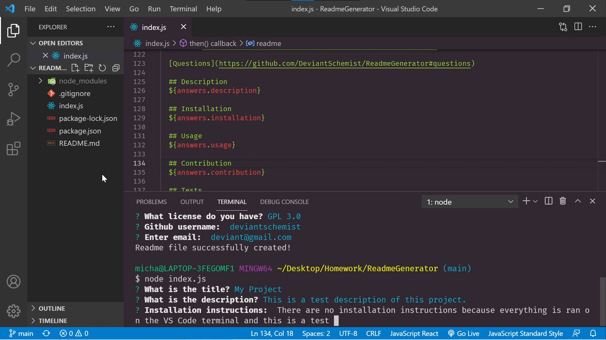

# ReadmeGenerator
Want to create a good README but just don't have the time? This is the application for you! README files are what give your application a story, one that is crafted by you, the developer, in order for others to understand what you built.

## Description
* Utilizes the npm module "Inquirer" in order to prompt the user for their responses. The responses are then displayed onto the README file, following the guidelines of this assignment
* Utilizes node.js to write to the README file
* Github for version control

## Installation Instructions
Have Node.js installed on your computer. All you need is a code editor like VS Code in order to run it in the program terminal.

## Usage
Run this command: node index.js, in the terminal of the code editor of your choice (in my case, VS Code) and prompts will appear which will allow you to enter the information. Once you are done inputting everything, a success message will appear and tell you that the README file has been successfully generated.

## Screenshot
